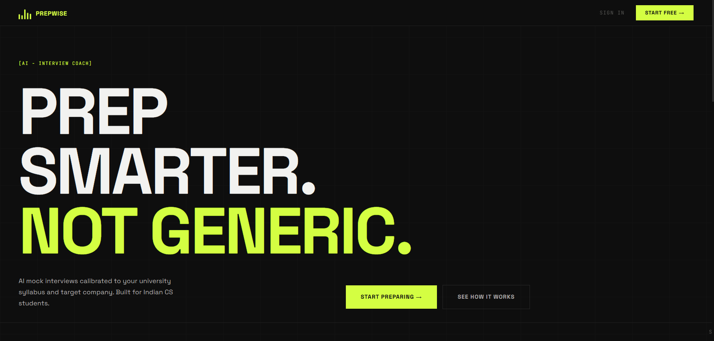
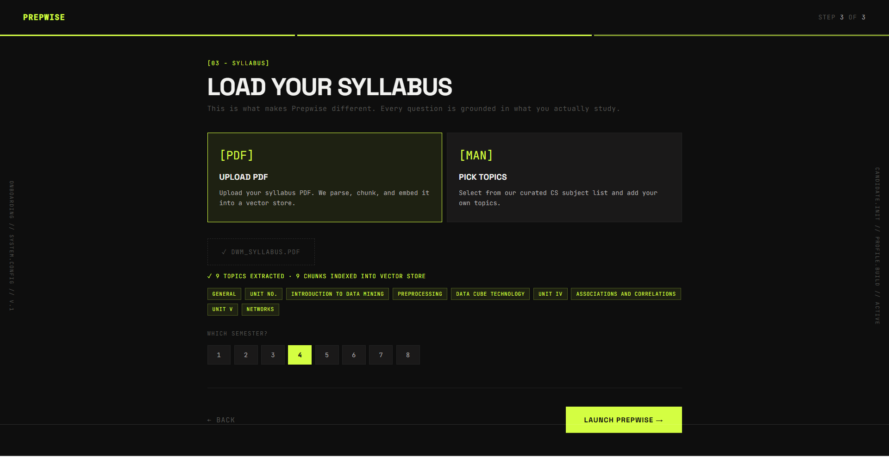
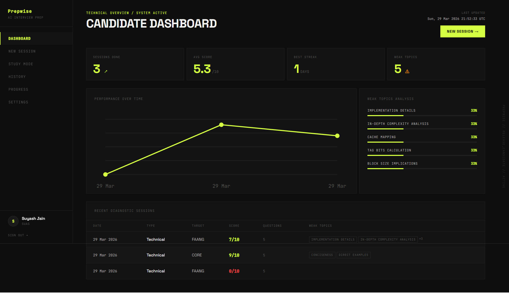
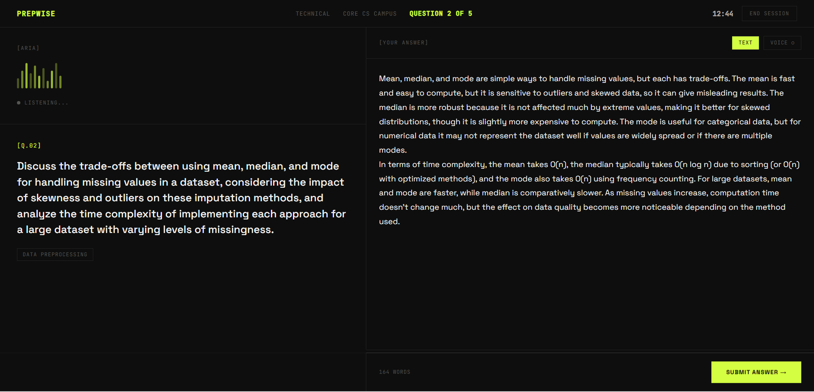
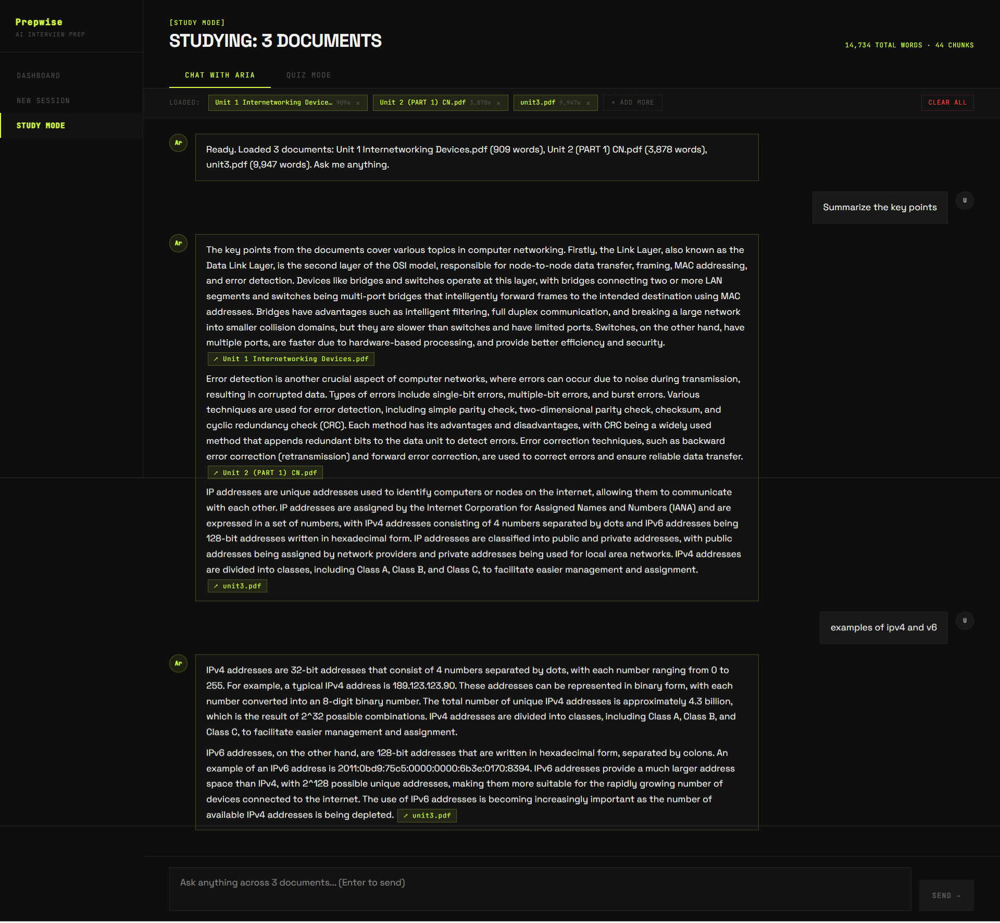
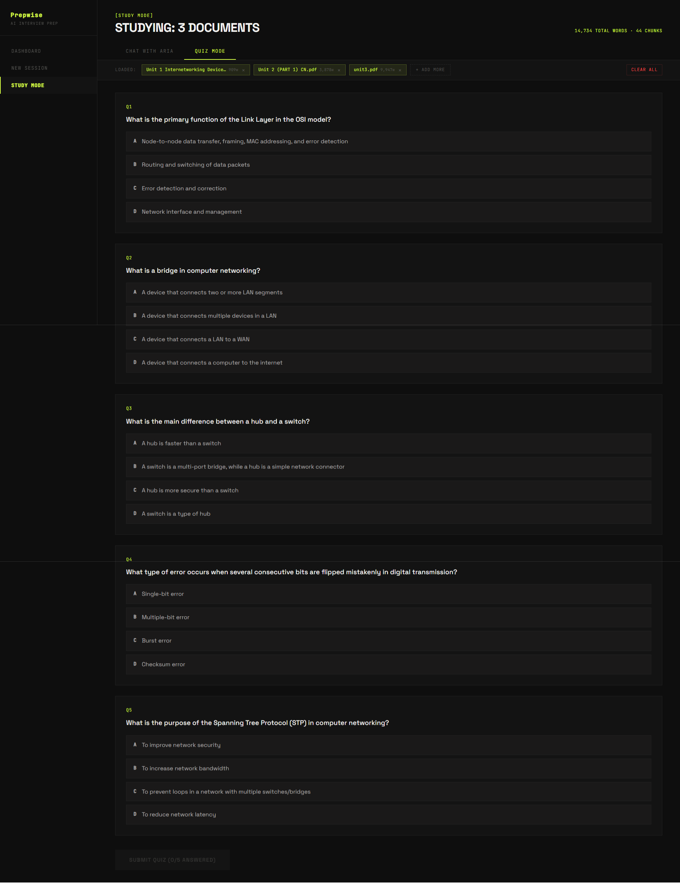
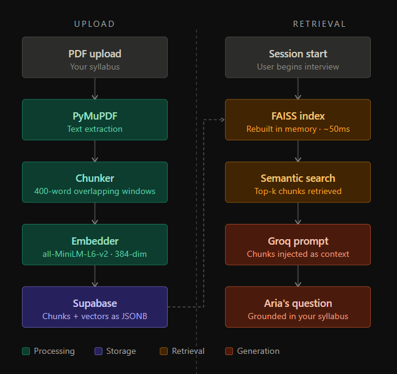
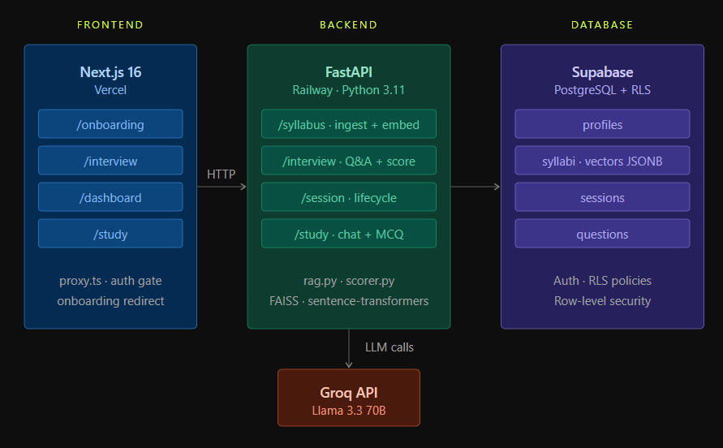

<div align="center">

# PREPWISE

### AI mock interviews grounded in your actual university syllabus.
### Not a question bank. Not a wrapper. A real RAG pipeline.

<br />

[](https://prepwise-mocha.vercel.app)
[](https://prepwise-production-eb53.up.railway.app/docs)
[](https://nextjs.org)
[](https://fastapi.tiangolo.com)
[](https://supabase.com)
[](./LICENSE)

<br />



</div>

---

## The problem

Every interview prep tool in India serves you the same recycled question bank. They don't know you covered **Data Warehousing** in Semester 4. They don't know your university ran a trimmed OS syllabus. They treat every CS student the same.

Campus placements aren't generic. Your preparation shouldn't be either.

## What Prepwise does differently

Upload your syllabus PDF. Prepwise parses it, chunks it, embeds it into a FAISS vector store, and uses semantic retrieval to generate interview questions **grounded in what you actually studied** — not pulled from a curated bank.

The AI persona **Aria** conducts the interview, scores every answer (0–10), gives contextual hints, reveals ideal answers, and surfaces weak topics across sessions.

**Study Mode** lets you upload any document set, chat with Aria across all of them with per-paragraph source citations, or generate an MCQ quiz in one click.

---

## Screenshots

<table>
<tr>
<td width="50%" align="center">

<sub><b>Onboarding</b> — PDF parsed, topics extracted, vector store built</sub>
</td>
<td width="50%" align="center">

<sub><b>Dashboard</b> — session history, performance chart, weak topic analysis</sub>
</td>
</tr>
<tr>
<td width="50%" align="center">

<sub><b>Interview Room</b> — Aria asking, voice waveform active, answer typed</sub>
</td>
<td width="50%" align="center">

<sub><b>Study Mode</b> — multi-doc chat with per-paragraph source citations</sub>
</td>
</tr>
</table>

<div align="center">

<br/><sub><b>Study Mode</b> — one-click MCQ quiz generated from uploaded documents</sub>
</div>

---

## Features

**Interview Mode**
- Syllabus-aware questions via RAG — no hardcoded question banks
- 4 interview types: Technical · HR/Behavioural · System Design · Subject-specific
- 4 company targets: FAANG · Product Startups · Service Companies · Core Campus
- Voice input (Web Speech API) + text — Aria adapts to both
- Per-answer scoring (0–10) with hints and ideal answer reveal
- Post-session debrief: weak topics, score breakdown, full answer review

**Study Mode**
- Upload multiple PDFs simultaneously and chat across all of them
- Every Aria response cites the specific source document and paragraph
- One-click MCQ quiz generation from any uploaded document set
- Grounded entirely in what you uploaded — not GPT's general knowledge

**Dashboard**
- Performance trend chart across all sessions (real Supabase data, not mocked)
- Weak topic tracker auto-surfaced from low-score answers over time
- Full session history with scores, types, and company targets
- Syllabus library — manage multiple uploaded syllabi per user

---

## Architecture

### RAG Pipeline

The core of Prepwise is a real retrieval-augmented generation pipeline — not a system prompt with topic keywords.



**Why JSONB + in-memory FAISS instead of pgvector?**
No pgvector extension required on free-tier Supabase. Vectors are stored once on upload and deserialized per session — no re-embedding, no cold start cost, no external vector DB dependency. FAISS index rebuilds in ~50ms from stored floats.

### System Overview



---

## Tech stack

| Layer | Technology |
|---|---|
| Frontend | Next.js 16, TypeScript, Tailwind CSS v4 |
| Backend | FastAPI, Python 3.11 |
| LLM | Groq — Llama 3.3 70B |
| Embeddings | sentence-transformers `all-MiniLM-L6-v2` |
| Vector search | FAISS IndexFlatL2 (in-memory, per session) |
| PDF parsing | PyMuPDF |
| Database + Auth | Supabase (PostgreSQL + RLS) |
| Frontend deploy | Vercel |
| Backend deploy | Railway |

---

## Getting started

### Prerequisites
- Node.js 18+ and Python 3.11
- A free [Supabase](https://supabase.com) project
- A free [Groq API key](https://console.groq.com)

### Step 1 — Supabase

<details>
<summary>Expand SQL</summary>

```sql
create table profiles (
  id uuid references auth.users on delete cascade primary key,
  full_name text, university text, semester int, target_role text,
  onboarding_complete boolean default false,
  created_at timestamp with time zone default timezone('utc', now())
);

create table syllabi (
  id uuid default gen_random_uuid() primary key,
  user_id uuid references profiles(id) on delete cascade,
  name text not null, university text, semester int,
  topics jsonb default '[]',
  raw_chunks jsonb default '[]',
  vectors jsonb default '[]',
  source text,
  created_at timestamp with time zone default timezone('utc', now())
);

create table sessions (
  id uuid default gen_random_uuid() primary key,
  user_id uuid references profiles(id) on delete cascade,
  syllabus_id uuid references syllabi(id),
  interview_type text, target_company text, total_questions int,
  score_avg numeric(4,2), weak_topics jsonb default '[]',
  completed boolean default false,
  created_at timestamp with time zone default timezone('utc', now())
);

create table questions (
  id uuid default gen_random_uuid() primary key,
  session_id uuid references sessions(id) on delete cascade,
  question_text text not null, user_answer text,
  score numeric(4,2), hint text, ideal_answer text,
  created_at timestamp with time zone default timezone('utc', now())
);

alter table profiles enable row level security;
alter table syllabi enable row level security;
alter table sessions enable row level security;
alter table questions enable row level security;

create policy "own profile" on profiles for all using (auth.uid() = id);
create policy "own syllabi" on syllabi for all using (auth.uid() = user_id);
create policy "own sessions" on sessions for all using (auth.uid() = user_id);
create policy "own questions" on questions for all using (
  auth.uid() = (select user_id from sessions where id = session_id)
);

create or replace function public.handle_new_user()
returns trigger as $$
begin
  insert into public.profiles (id, full_name)
  values (new.id, new.raw_user_meta_data->>'full_name');
  return new;
end;
$$ language plpgsql security definer;

create trigger on_auth_user_created
  after insert on auth.users
  for each row execute procedure public.handle_new_user();
```

</details>

### Step 2 — Backend

```bash
cd backend
python -m venv venv
venv\Scripts\activate        # Windows
source venv/bin/activate     # macOS/Linux
pip install -r requirements.txt
```

Create `backend/.env`:

```env
GROQ_API_KEY=your_key
SUPABASE_URL=https://your-project.supabase.co
SUPABASE_SERVICE_KEY=your_service_role_key
FRONTEND_URL=http://localhost:3000
```

```bash
uvicorn app.main:app --reload --port 8000
```

### Step 3 — Frontend

```bash
cd frontend
npm install
```

Create `frontend/.env.local`:

```env
NEXT_PUBLIC_SUPABASE_URL=https://your-project.supabase.co
NEXT_PUBLIC_SUPABASE_ANON_KEY=your_anon_key
NEXT_PUBLIC_API_URL=http://localhost:8000
```

```bash
npm run dev
```

Visit [localhost:3000](http://localhost:3000). Sign up — onboarding triggers automatically.

---

## Project structure

```
prepwise/
├── frontend/
│   ├── app/
│   │   ├── (auth)/                  # login, signup
│   │   ├── (dashboard)/dashboard/   # stats, history, weak topics
│   │   ├── onboarding/              # 3-step wizard
│   │   ├── interview/[sessionId]/   # live interview room
│   │   └── study/                  # document chat + MCQ
│   ├── proxy.ts                     # auth guard + onboarding gate
│   └── lib/supabase/
│
└── backend/
    └── app/
        ├── routers/
        │   ├── interview.py         # Q&A loop, scoring, debrief
        │   ├── session.py           # session lifecycle
        │   ├── syllabus.py          # PDF ingest, chunking, embedding
        │   └── study.py             # multi-file chat, MCQ generation
        └── services/
            ├── rag.py               # FAISS index + semantic retrieval
            ├── gemini.py            # Groq LLM wrapper
            └── scorer.py           # per-answer evaluation
```

---

## Roadmap

- [ ] Google OAuth
- [ ] Resume upload + resume-grounded questions
- [ ] Session debrief export as PDF
- [ ] College-specific syllabus presets
- [ ] Peer challenge / shared sessions

---

## License

MIT — fork it, extend it, deploy your own.

---

<div align="center">
<br/>

**[Suyash Vasal Jain](https://github.com/SuyashVJain)** · CS student, SUAS Indore

[](https://prepwise-mocha.vercel.app)

</div>